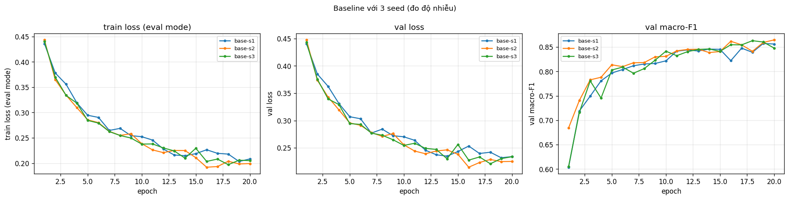
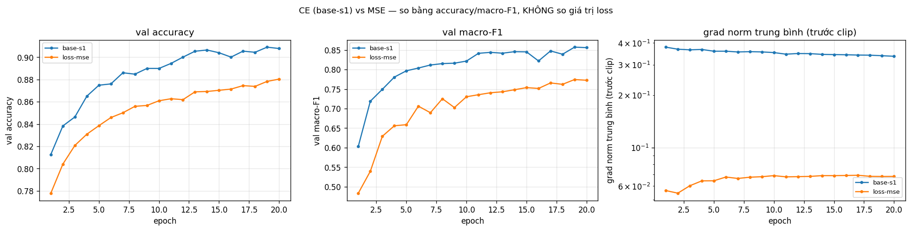
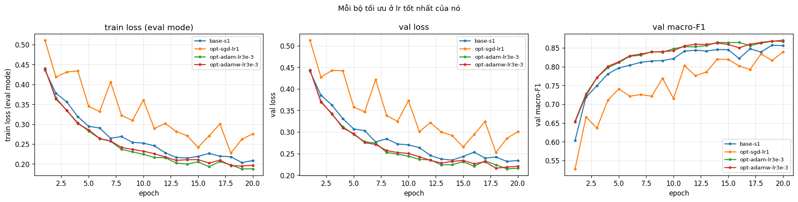
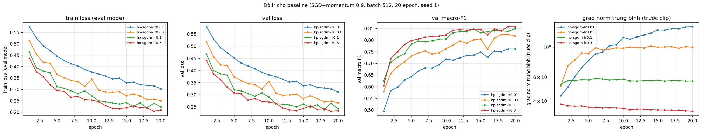
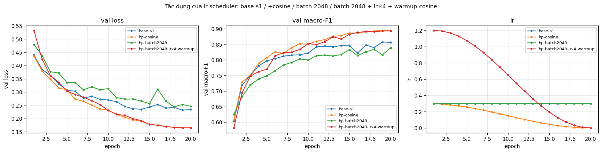
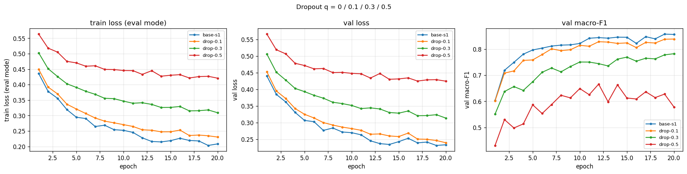
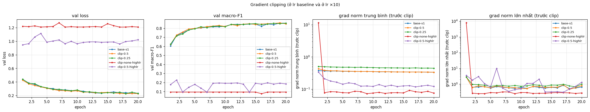
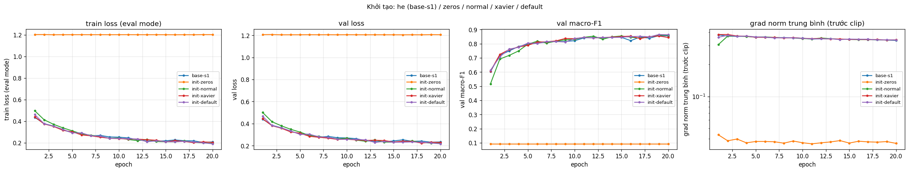

# Báo cáo Lab Day 1 — Phạm Văn Hoàng Anh Tú — 2A202602507

## 1. Thiết lập

- **Môi trường:** Google Colab, GPU Tesla T4, Python 3.13, PyTorch 2.11.0+cu130.
- **Dữ liệu:** Forest CoverType; `train` 464 809 / `eval` 116 203 theo `split_metadata.csv` (tạo bằng `scripts/split_data.py`). Validation: 20% của train, phân tầng, seed 42 → 371 847 train / 92 962 val. Chuẩn hoá 10 cột số bằng mean/std tính **chỉ trên phần train**; 44 cột nhị phân giữ nguyên. Train loss đo ở chế độ `eval()` trên 50 000 mẫu train cố định.
- **Model:** `M-base` 54→256→128→7, ReLU, 47 879 tham số (có `assert`), logit thô (softmax nằm trong loss).
- **Baseline:** cross-entropy, SGD + momentum 0,9, **lr = 0,3** (chọn bằng val, mục 3.3), batch 512, 20 epoch, khởi tạo He (`kaiming_normal_`, bias 0), không dropout, không clip, FP32. Báo cáo metric ở epoch có val loss thấp nhất.
- **Mốc "đoán lớp đa số"** (luôn đoán lớp 1) trên val: accuracy = 0,4876, macro-F1 ≈ 0,094.
- **Chủ đề đã thử:** ☑ loss ☑ optimizer ☑ hyper-parameter ☑ dropout ☑ clipping ☑ mixed precision ☑ init — tổng **42 lần chạy**, mỗi lần một dòng trong `experiments.xlsx` và một ảnh `figures/<exp_id>.png`.

## 2. Kiểm tra ban đầu và độ nhiễu

| Kiểm tra | Kết quả |
|---|---|
| Số tham số / shape logits | 47 879 / (B, 7) |
| Loss bước 0 (so với ln 7 = 1,946) | 2,378 (Part 1, seed 42); 2,269 (`base-s1`) |
| Quá khớp 20 mẫu: loss cuối | 1,967 → 0,000267 sau 500 bước Adam, accuracy 100% |
| Mọi tham số có gradient khác 0 | ☑ có (grad norm W1…b3 từ 0,38 đến 2,37) |
| Baseline, số seed đã chạy | 3 (`base-s1`, `base-s2`, `base-s3`) |
| Baseline: val acc (TB ± σ) | 0,9118 ± 0,0027 |
| Baseline: val macro-F1 (TB ± σ) | 0,8607 ± 0,0030 |

Loss bước 0 cao hơn ln 7 vì khởi tạo He áp dụng cả cho lớp ra: logit ban đầu có std ≈ 0,58–0,65, và vì ReLU ≥ 0 nên mỗi lớp nhận một độ lệch cố định giống nhau cho mọi mẫu (model "thiên vị" ngẫu nhiên vài lớp từ đầu). Với Xavier hoặc khởi tạo mặc định, loss bước 0 về 2,02 và 1,98 (mục 3.7); phép thử quá khớp 20 mẫu thành công nên đây không phải lỗi code.

**Ngưỡng nhiễu dùng trong báo cáo:** 2σ = **0,0060** (val macro-F1). Δ trong báo cáo luôn tính so với trung bình 3 seed (0,8607). Hạn chế: σ ước lượng từ 3 seed còn thô, và dao động giữa các epoch trong một lần chạy (đến ≈ 0,015) lớn hơn σ giữa seed, nên các chênh lệch chỉ vừa vượt 2σ được coi là **chưa đủ bằng chứng**.

## 3. Kết quả theo chủ đề (tất cả trên val; mọi thí nghiệm seed 1, chỉ đổi một yếu tố)

### 3.1 Hàm mất mát — CE vs MSE
- **Dự đoán:** MSE kém hơn và chậm hơn, vì gradient của CE không bão hoà khi sai nặng.
- **Kết quả:** `loss-mse` có val macro-F1 0,7726 (Δ = −0,088) và accuracy 0,8803 (Δ = −0,032). **Khớp dự đoán.** 
- **Cơ chế:** grad norm trung bình của MSE chỉ 0,066 so với 0,352 của CE (≈ 5 lần nhỏ hơn), vì gradient theo logit là 2(z − y)/7 rồi còn chia trung bình trên B×7 phần tử, nên model học chậm (best epoch = 20). Macro-F1 giảm gần gấp 3 lần accuracy: MSE phạt đều cả 7 logit, không tập trung vào lớp đúng như softmax + CE, nên lớp hiếm bị bỏ rơi. Không so giá trị loss (khác thang đo).

### 3.2 Bộ tối ưu hoá
- **Dự đoán:** SGD thuần cần lr lớn hơn ≈ 10 lần; Adam nhanh hơn ở đầu nhưng cuối cùng ngang SGD+momentum; AdamW ≈ Adam.

| Bộ tối ưu | lr đã thử → val macro-F1 | lr tốt nhất (`exp_id`) | best epoch | Δ |
|---|---|---|---|---|
| SGD+momentum 0,9 | 0,01→0,761 · 0,03→0,817 · 0,1→0,839 · 0,3→0,857 | 0,3 (`base-s1`) | 19 | — |
| SGD | 0,3→0,816 · 1→0,834 · 3→0,616 | 1 (`opt-sgd-lr1`) | 18 | −0,026 |
| Adam | 3e-4→0,788 · 1e-3→0,846 · 3e-3→0,868 | 3e-3 (`opt-adam-lr3e-3`) | 19 | +0,007 |
| AdamW (wd 0,01) | 1e-3→0,848 · 3e-3→0,865 | 3e-3 (`opt-adamw-lr3e-3`) | 18 | +0,004 |

- **Độ nhạy với lr:** cả 4 bộ đều thay đổi tới 0,05–0,25 macro-F1 theo lr, nhiều hơn hẳn chênh lệch giữa các bộ ở lr tốt nhất. SGD thuần ở lr 1 và 3 cho val loss răng cưa mạnh. 
- **Giải thích:** Adam học nhanh hơn ở đầu (epoch 1: macro-F1 0,655 so với 0,604) nhờ chia bước theo độ lớn gradient của từng tham số, nhưng sau 20 epoch chỉ hơn 0,007, sát ngưỡng với 1 seed, nên **chưa kết luận Adam thắng**. SGD thuần với lr 3 (bước hiệu dụng ngang SGD+momentum lr 0,3) lại kém hẳn: momentum còn **lấy trung bình gradient qua ≈ 10 bước**, làm giảm nhiễu mini-batch. Đây là điểm dự đoán sai một nửa. Adam và AdamW chênh nhau trong nhiễu vì model chưa quá khớp. Hạn chế: lr tốt nhất của Adam/AdamW là giá trị lớn nhất đã thử.

### 3.3 Hyper-parameter
Dò lr của baseline (`hp-sgdm-lr*`): lr càng lớn càng tốt trong 20 epoch; lr 0,01 và 0,03 còn đang giảm ở epoch 20 → chọn 0,3 (lớn nhất đã thử, hạn chế). 

| `exp_id` | số bước | s/epoch | val mF1 | Δ | so với dự đoán |
|---|---|---|---|---|---|
| `hp-batch128` | 58 120 | 5,22 | 0,7951 | −0,066 | **sai** |
| `hp-batch2048` | 3 640 | 0,35 | 0,8338 | −0,027 | khớp |
| `hp-batch2048-lrx4-warmup` (đổi 3 yếu tố) | 3 640 | 0,37 | 0,8928 | +0,032 | tốt hơn dự đoán |
| `hp-cosine` (chỉ thêm cosine) | 14 540 | 1,31 | 0,8947 | +0,034 | khớp giả thuyết |
| `hp-wide` (161 287 tham số) | 14 540 | 1,32 | 0,8747 | +0,014 | khớp |
| `hp-deep` (55 687 tham số) | 14 540 | 1,45 | 0,8413 | −0,019 | **sai** |
| `hp-ep40` (best epoch 32) | 29 080 | 1,32 | 0,8733 | +0,013 | khớp |

- **Batch 128** kém dù gấp 4 số bước: phương sai gradient ∝ 1/B, giữ lr 0,3 thì mỗi bước nhiễu gấp 4 lần và SGD dao động quanh đáy. So sánh công bằng cần lr ÷ 4 (quy tắc tăng lr theo lô), chưa thử (hạn chế). **Batch 2048 giữ lr** thiếu bước cập nhật (ít hơn 4 lần) nên chưa học xong.
- **Phát hiện chính:** `hp-batch2048-lrx4-warmup` đổi 3 yếu tố cùng lúc. Thí nghiệm tách `hp-cosine` (batch 512, chỉ thêm cosine) đạt 0,8947, ngang nó, nên **giảm lr dần về 0 mới là yếu tố quyết định**: lr 0,3 cố định khiến SGD nhảy quanh đáy (val macro-F1 răng cưa), còn lr nhỏ dần ở cuối cho phép "đậu" vào đáy (val loss 0,165 so với 0,232). Batch 2048 + lr ×4 cho cùng chất lượng nhưng **nhanh gấp 3,5 lần mỗi epoch** (0,37 so với 1,31 s). 
- **M-wide** tốt hơn (+0,014), thời gian gần như không đổi (GPU chưa dùng hết sức). **M-deep** có val loss tốt hơn `base-s1` (0,222 so với 0,232) nhưng macro-F1 kém hơn: khác biệt nằm ở vài lớp hiếm; *phỏng đoán* lớp 64 nơ-ron là nút cổ chai, chưa kiểm chứng.

### 3.4 Dropout
| q | val mF1 | Δ | val − train loss (epoch cuối) |
|---|---|---|---|
| 0 (`base-s1`) | 0,8573 | — | +0,026 |
| 0,1 (`drop-0.1`) | 0,8385 | −0,022 | +0,0095 |
| 0,3 (`drop-0.3`) | 0,7824 | −0,078 | +0,0050 |
| 0,5 (`drop-0.5`) | 0,5784 | −0,282 | +0,0040 |

Baseline **không quá khớp** (khoảng cách chỉ 0,026), nên dropout không có gì để chữa. Khoảng cách thu hẹp vì train loss tăng (0,208 → 0,421), không phải vì val loss giảm; mỗi bước chỉ cập nhật một mạng con ngẫu nhiên nên học chậm hơn (cả 3 lần chạy best epoch = 20). Dự đoán "q = 0,1 trong nhiễu" sai: kém 0,022. 

### 3.5 Gradient clipping
- **Ở lr bình thường:** grad norm baseline trung bình 0,352, lớn nhất mỗi epoch 0,47–0,91 (gai 2,84 ở epoch 1). Với `clip-0.5` chỉ 1,4% số bước bị cắt, nên về cơ chế gần như không tác động. Macro-F1 −0,013 nhưng val loss lại tốt hơn (0,2279 so với 0,2318): hai chỉ số mâu thuẫn, nên mình coi là nhiễu quỹ đạo, **không có tác dụng thực**. `clip-0.25` cắt 100% số bước (thành "bước độ dài cố định"), kết quả gần baseline (−0,006).
- **Ở lr × 10 = 3:** `clip-none-highlr` không ra NaN, nhưng epoch 1 có bước với grad norm ≈ 7 800 rồi model **sụp về đoán lớp đa số** suốt 20 epoch (grad norm còn ≈ 0,08: nhiều ReLU "chết"). `clip-0.5-highlr` chặn được cú gai (grad norm lớn nhất 3,6), model không chết nhưng chỉ đạt 0,18. Clip giới hạn gradient, nhưng bước = lr × vận tốc momentum vẫn tới ≈ 3 × 0,5 × 10 = 15. **Clipping chữa gai gradient thỉnh thoảng xảy ra, không chữa được lr quá lớn.** 

### 3.6 Mixed precision
| `exp_id` | s/epoch | peak MB | val mF1 | Δ |
|---|---|---|---|---|
| `base-s1` (FP32) | 1,34 | 162,2 | 0,8573 | — |
| `amp-fp16` (autocast + GradScaler) | 1,79 (+34%) | 162,2 | 0,8597 | −0,001 |
| `amp-bf16` (autocast, không scaler) | 1,60 (+19%) | 162,2 | 0,8520 | −0,009 |

Mixed precision **chậm hơn**: mạng 48 nghìn tham số có phép nhân ma trận quá nhỏ để Tensor Core có lợi; thời gian bị chi phối bởi chi phí gọi kernel, cộng thêm ép kiểu và GradScaler. T4 không có phần cứng BF16 (giả lập). Bộ nhớ không đổi vì 162 MB chủ yếu là dữ liệu nạp sẵn trên GPU (≈ 125 MB). FP16 trong nhiễu; BF16 thấp hơn 0,009 (1 seed; *phỏng đoán:* BF16 chỉ có 8 bit định trị nên sai số làm tròn lớn hơn). FP16 cần nhân loss với hệ số s vì giá trị dương nhỏ nhất ≈ 6e-5 (gradient nhỏ tràn dưới về 0); BF16 có 8 bit mũ như FP32 nên thường không cần.

### 3.7 Khởi tạo tham số
| init | std ReLU1 | std ReLU2 | std logit | loss bước 0 | val mF1 |
|---|---|---|---|---|---|
| zeros (`init-zeros`) | 0 | 0 | 0 | 1,9459 | 0,0936 |
| normal 0,01 (`init-normal`) | 0,020 | 0,0022 | 0,0003 | 1,9460 | 0,8609 |
| xavier (`init-xavier`) | 0,163 | 0,125 | 0,192 | 2,0222 | 0,8502 |
| he (`base-s1`) | 0,390 | 0,366 | 0,577 | 2,2691 | 0,8573 |
| default (`init-default`) | 0,160 | 0,068 | 0,059 | 1,9830 | 0,8637 |

**zeros** đúng như dự đoán: kích hoạt ẩn bằng 0 nên mọi gradient trừ b3 bằng 0 (grad norm 0,038), model chỉ học tỉ lệ lớp, kẹt ở acc 0,4876. **normal 0,01** co tín hiệu ≈ 10 lần mỗi lớp, nên khởi động chậm (epoch 1: 0,517 so với 0,604) nhưng đuổi kịp từ epoch 5. He giữ std ổn định qua các lớp, đúng thiết kế cho ReLU. Tuy vậy normal, xavier, default và he chênh nhau ≤ 0,011 sau 20 epoch: với mạng 3 lớp, tín hiệu co vài lần chưa đủ chặn việc học, nên **không kết luận được** cách nào tốt hơn. 

## 4. Đánh giá cuối trên tập eval

**Chọn cấu hình chỉ bằng val**, với quy tắc đặt trước: mỗi ứng viên chạy 3 seed, chọn ứng viên có val macro-F1 trung bình cao nhất, nộp model seed 1.

| Ứng viên (40 epoch, batch 2048, lr 1,2, warmup 5% + cosine) | val mF1 seed 1 / 2 / 3 | TB ± σ |
|---|---|---|
| M-base (`fin-b2048-wc-ep40-s*`) | 0,9121 / 0,9159 / 0,9146 | 0,9142 ± 0,0019 |
| **M-wide** (`fin-wide-b2048-wc-ep40-s*`) | 0,9277 / 0,9268 / 0,9240 | **0,9262 ± 0,0019** |

| Cấu hình | Seed nộp | val macro-F1 | **eval macro-F1** | eval accuracy |
|---|---|---|---|---|
| Baseline (`base-s1`) | 1 | 0,8573 | **0,8565** | 0,9089 |
| Cấu hình cuối (`fin-wide-b2048-wc-ep40-s1`) | 1 | 0,9277 | **0,9308** | 0,9562 |

- **Cấu hình cuối** kết hợp các yếu tố có lợi trên val: lịch lr warmup + cosine (+0,034), batch 2048 với lr ×4 (nhanh gấp 3,5 lần), M-wide (+0,014) và 40 epoch (+0,013). Train loss 0,062 so với val loss 0,115: khoảng cách đã lớn gấp đôi baseline nhưng best epoch vẫn là 39–40, nên chưa quá khớp tới mức có hại.
- **Cải thiện trên eval: +0,074 macro-F1** (+0,047 accuracy), lớn hơn ≈ 12 lần ngưỡng nhiễu 0,006. Trên val, cải thiện trung bình 3 seed là +0,066 với σ của cả hai bên ≈ 0,002–0,003, nên chắc chắn vượt nhiễu.
- **Val và eval rất gần nhau:** −0,0008 (baseline) và +0,0031 (cấu hình cuối), khớp với mốc ≤ 0,005 của giảng viên: val là ước lượng đáng tin của eval.

### 4.1 Phân tích lỗi theo lớp (cấu hình cuối, từ `eval_result.json`)

| Lớp | mẫu train | support | precision | recall | F1 | F1 baseline |
|---|---|---|---|---|---|---|
| 0 Spruce/Fir | 135 578 | 42 368 | 0,9567 | 0,9514 | 0,9540 | 0,9044 |
| 1 Lodgepole Pine | 181 312 | 56 661 | 0,9601 | 0,9660 | 0,9631 | 0,9263 |
| 2 Ponderosa Pine | 22 882 | 7 151 | 0,9556 | 0,9565 | 0,9560 | 0,8943 |
| 3 Cottonwood/Willow | 1 759 | 549 | 0,8929 | 0,8652 | **0,8788** | 0,8015 |
| 4 Aspen | 6 075 | 1 899 | 0,9015 | 0,8768 | 0,8889 | 0,7595 |
| 5 Douglas-fir | 11 115 | 3 473 | 0,9182 | 0,9113 | 0,9147 | 0,8089 |
| 6 Krummholz | 13 126 | 4 102 | 0,9630 | 0,9576 | 0,9603 | 0,9002 |

- **Lớp khó nhất là lớp 3 Cottonwood/Willow (F1 = 0,8788).** Nó hay bị nhầm với **lớp 2 Ponderosa Pine** (48 mẫu, 8,7%) và **lớp 5 Douglas-fir** (26 mẫu, 4,7%).
- **Lý giải bằng dữ liệu:** lớp 3 chỉ có 1 759 mẫu train (0,47%). Elevation của nó (2 224 ± 102 m) chồng lấn với lớp 2 (2 394 ± 196 m) và lớp 5 (2 418 ± 189 m): cả ba đều là các lớp ở độ cao thấp nhất, nên đặc trưng quan trọng nhất không tách được chúng. Recall (0,865) thấp hơn precision (0,893): khi không chắc, model nghiêng về lớp láng giềng nhiều mẫu hơn. Tương tự, lớp 4 Aspen (F1 0,889) bị đoán thành lớp 1 Lodgepole 9,8%, vì elevation 2 788 ± 96 m nằm gọn trong khoảng của lớp 1 (2 921 ± 186 m). Về số lượng tuyệt đối, cặp nhầm lớn nhất là **0 ↔ 1** (1 899 + 1 644 mẫu): hai lớp lớn nhất có elevation gần nhau (3 129 so với 2 921 m).
- So với baseline, các lớp hiếm cải thiện nhiều nhất (lớp 4: +0,129; lớp 5: +0,106; lớp 3: +0,077), nên macro-F1 tăng nhiều hơn accuracy.
- **Cách cải thiện sẽ thử:** cross-entropy có trọng số theo lớp (hoặc lấy mẫu lại lớp hiếm), chọn bằng val macro-F1, để đẩy recall của lớp 3 và lớp 4.

## 5. Trả lời các câu hỏi dẫn dắt

1. **Bộ tối ưu nào thắng khi chỉnh lr công bằng?** Ở lr tốt nhất của mỗi bộ: Adam (0,868) ≈ AdamW (0,865) ≈ SGD+momentum (0,857, TB 3 seed 0,861); chênh lệch ≤ 0,007, chỉ vừa chạm ngưỡng nhiễu, nên không có bộ nào thắng rõ. Chỉ SGD thuần kém rõ (−0,026). Nếu không chỉnh lr, kết luận đổi hẳn: ví dụ so Adam lr 3e-4 (0,788) với SGD+momentum lr 0,3 sẽ "chứng minh" SGD thắng 0,07, còn Adam 3e-3 với SGD+momentum 0,01 (0,761) lại "chứng minh" ngược lại. Độ nhạy với lr lớn hơn khác biệt giữa các bộ tối ưu.
2. **Dropout có giúp khi chưa quá khớp không?** Không: q = 0,1 / 0,3 / 0,5 làm macro-F1 giảm 0,02 / 0,08 / 0,28, vì baseline chỉ có khoảng cách val − train 0,026. Nên dùng khi train loss tiếp tục giảm mà val loss đi ngang hoặc tăng (khoảng cách lớn và đang tăng), ví dụ mạng rộng hơn huấn luyện lâu hơn như cấu hình cuối (khoảng cách 0,053).
3. **Gradient clipping giải quyết vấn đề gì?** Các bước gradient đột ngột rất lớn. Bằng chứng: ở lr 3 không clip, một gai grad norm ≈ 7 800 ở epoch 1 làm model chết hẳn; có clip c = 0,5 thì gai bị chặn (max 3,6) và model còn sống. Nhưng clip không thay được việc chọn lr đúng (vẫn chỉ 0,18), và ở lr bình thường gần như không kích hoạt (1,4% số bước).
4. **Mixed precision có nhanh hơn không?** Không: FP16 chậm hơn 34%, BF16 chậm hơn 19% trên T4. Mạng quá nhỏ nên thời gian bị chi phối bởi chi phí gọi kernel chứ không phải phép tính; autocast và GradScaler thêm việc; T4 không có phần cứng BF16. Mixed precision chỉ có lợi khi phép nhân ma trận đủ lớn (mạng rộng hoặc batch lớn).
5. **Vì sao khởi tạo toàn số 0 hỏng?** Mọi nơ-ron trong một lớp giống hệt nhau (đối xứng) và ReLU(0) = 0, nên gradient của mọi trọng số bằng 0; chỉ bias lớp ra học được (`init-zeros`: kẹt ở acc 0,4876). He dùng Var = 2/n_vào để bù việc ReLU cắt một nửa tín hiệu, giữ std kích hoạt ổn định qua các lớp (0,39 → 0,37); Xavier dùng Var = 2/(n_vào + n_ra), hợp với hàm kích hoạt đối xứng, nên với ReLU std co dần (0,16 → 0,12). Khác biệt quan trọng ở mạng **sâu**, vì độ co/giãn nhân lên qua nhiều lớp; với mạng 3 lớp ở đây, sau 20 epoch kết quả chênh ≤ 0,011.
6. **Loss không giảm sau 2 000 bước: 3 phép kiểm tra đầu tiên.**
   1. **Loss bước 0 so với ln C (= 1,946)** trước khi huấn luyện. Lệch xa (ví dụ ≈ 0 hoặc rất lớn) là dấu hiệu lỗi nhãn, softmax hai lần, hoặc khởi tạo quá lớn. Ở đây: 2,27 với He, 1,95 với zeros/normal; giải thích được.
   2. **Quá khớp một lô nhỏ (20 mẫu).** Không về được gần 0 thì gần như chắc chắn là lỗi code (quên `zero_grad`, tham số không nằm trong optimizer, nhãn lệch), không phải do mô hình yếu. Ở đây: về 0,00027 sau 500 bước.
   3. **Grad norm từng lớp và độ nhạy với lr.** Grad norm ≈ 0 ở các lớp ẩn nghĩa là gradient không chảy (`init-zeros`: chỉ còn 0,038 từ b3; `clip-none-highlr`: ≈ 0,08 sau khi ReLU chết). Gai grad norm rất lớn nghĩa là lr quá lớn (≈ 7 800 ở lr 3). Loss giảm rất chậm và còn đều nghĩa là lr quá nhỏ (lr 0,01 vẫn giảm ở epoch 20). Sau đó chạy nhanh vài lr cách nhau 3–10 lần.

## 6. Hạn chế và điều bất ngờ

- **Khác dự đoán:** batch 128 kém hẳn (do giữ nguyên lr); M-deep kém dù val loss tốt hơn; SGD thuần lr 3 không tương đương SGD+momentum lr 0,3; dropout 0,1 đã gây hại rõ; clip ở lr ×10 chỉ "cứu" được một phần. Bất ngờ lớn nhất: chỉ riêng lịch lr cosine đã cho +0,034, nhiều hơn mọi thay đổi khác.
- **Có thể làm sai kết luận:** chỉ 3 seed để ước lượng nhiễu, mỗi thí nghiệm chỉ 1 seed; nhiều chênh lệch 0,006–0,013 nằm cùng cỡ với dao động giữa các epoch. Thí nghiệm batch so ở cùng số epoch (khác số bước) và cùng lr. Với baseline, Adam và AdamW, lr tốt nhất là giá trị lớn nhất đã thử. Thí nghiệm `hp-batch2048-lrx4-warmup` và cấu hình cuối đổi nhiều yếu tố cùng lúc (đã tách riêng tác dụng scheduler bằng `hp-cosine`).
- **Nếu có thêm thời gian:** chạy 3 seed cho các thí nghiệm sát ngưỡng (Adam, clip-0.5, xavier, BF16); thử batch 128 với lr ÷ 4; dò lr lớn hơn cho Adam và SGD+momentum; thử cross-entropy có trọng số theo lớp cho lớp 3 và lớp 4; thử dropout nhỏ trên cấu hình cuối, vốn đã bắt đầu có khoảng cách train–val.

## 7. Phụ lục

- **File đã nộp:** `REPORT.md`, `experiments.xlsx` (42 dòng; sheet Seeds dùng `base-s1..3`), `predictions_eval.csv` + `eval_result.json` (cấu hình cuối), `eval_baseline/predictions_eval.csv` + `eval_baseline/eval_result.json` (baseline), `figures/` (42 ảnh `<exp_id>.png` + 12 ảnh `compare_*.png`), `results/` (42 file JSON), `code/` (`lab.ipynb`, `data.py`, `model.py`, `optimizer.py`, `train.py`, `plots.py`, `results_table.py`).
- **Thời gian chạy:** ≈ 19 phút huấn luyện thuần trên T4 cho 42 lần chạy (tổng cộng ≈ 30 phút khi tính cả đánh giá, vẽ ảnh và các phép thử).
